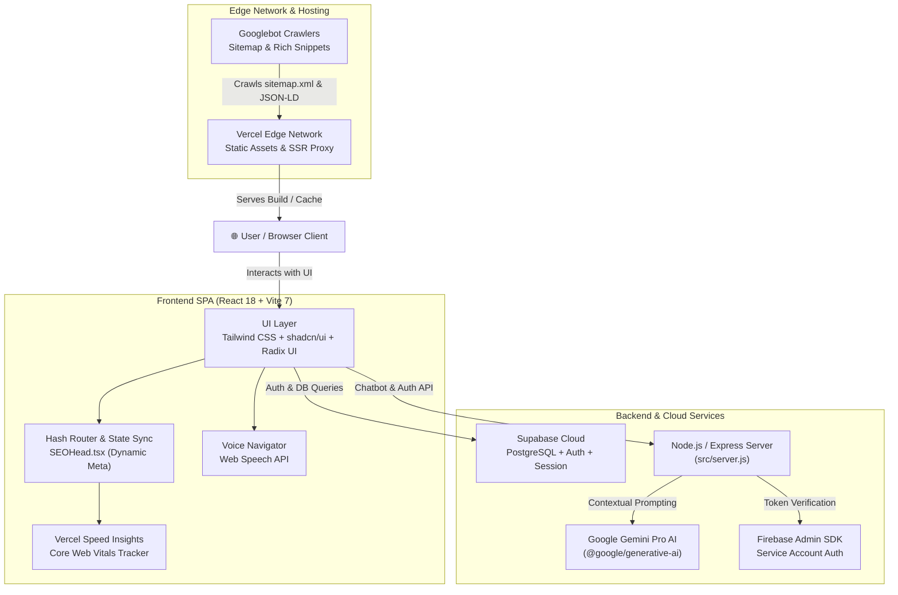

# 🏛️ University Institute of Technology, Shivpuri (UIT RGPV) — Official Web Portal

[](https://uit-rgpv-web-isqm.vercel.app/)
[](https://react.dev/)
[](https://www.typescriptlang.org/)
[](https://vitejs.dev/)
[](https://tailwindcss.com/)
[](https://supabase.com/)
[](https://ai.google.dev/)
[](https://pagespeed.web.dev/)

---

## 📖 Table of Contents

- [🏛️ Overview](#-overview)
- [🏗️ System Architecture](#️-system-architecture)
- [✨ Key Features](#-key-features)
  - [🎓 1. Academic & Curriculum Hub](#-1-academic--curriculum-hub)
  - [🏢 2. Engineering Departments](#-2-engineering-departments)
  - [👨‍🏫 3. Faculty & Staff Directory](#-3-faculty--staff-directory)
  - [💼 4. Training & Placement Cell (T&P)](#-4-training--placement-cell-tp)
  - [🤖 5. Built-in Gemini AI Assistant](#-5-built-in-gemini-ai-assistant)
  - [🎙️ 6. Hands-Free Voice Navigator](#️-6-hands-free-voice-navigator)
  - [🎪 7. Student Clubs & Societies](#-7-student-clubs--societies)
  - [📢 8. Live Notice Board & Campus Navigation](#-8-live-notice-board--campus-navigation)
  - [📸 9. High-Performance Photo Gallery](#-9-high-performance-photo-gallery)
- [⚡ Performance & Core Web Vitals Benchmark](#-performance--core-web-vitals-benchmark)
- [🔍 SEO & Structured Data Implementation](#-seo--structured-data-implementation)
- [🛠️ Tech Stack](#️-tech-stack)
- [📁 Project Directory Structure](#-project-directory-structure)
- [🔌 Backend API Reference](#-backend-api-reference)
- [💻 Local Development Guide](#-local-development-guide)
- [🚀 Deployment Guide](#-deployment-guide)
- [❓ Frequently Asked Questions (FAQ)](#-frequently-asked-questions-faq)
- [🗺️ Project Roadmap](#️-project-roadmap)
- [🤝 Contributing Guidelines](#-contributing-guidelines)
- [👨‍💻 Team & Acknowledgments](#-team--acknowledgments)
- [📄 License & Attribution](#-license--attribution)

---

## 🏛️ Overview

The **University Institute of Technology, Shivpuri (UIT RGPV)** web portal is a modern, responsive, and high-performance digital campus platform. Established in 2020 by the Government of Madhya Pradesh as a constituent institute of **Rajiv Gandhi Proudyogiki Vishwavidyalaya (RGPV), Bhopal**, the college offers 4-year undergraduate B.Tech programs in four core disciplines.

This web application serves as the primary digital home for prospective candidates, enrolled undergraduates, faculty members, recruiters, and alumni—providing access to academic syllabi, real-time notices, faculty directories, placement records, campus events, and an interactive Gemini-powered AI Assistant.

* **Live Deployment:** [https://uit-rgpv-web-isqm.vercel.app/](https://uit-rgpv-web-isqm.vercel.app/)
* **Institution:** University Institute of Technology, Shivpuri (RGPV Bhopal)
* **Location:** Jhansi Road, Satanwara Kalan, Shivpuri, Madhya Pradesh – 473551
* **Motto:** *"समर्पितो भव उत्कृष्टतायें"* (Dedicated to Excellence)

---

## 🏗️ System Architecture

The following diagram illustrates the relationship between the client application, backend services, external APIs, and cloud infrastructure:



---

## ✨ Key Features

### 🎓 1. Academic & Curriculum Hub
* **Multi-Year Syllabi & Schemes:** Comprehensive semester-wise syllabus (Semesters 1 through 8) and grading schemes for all 4 academic years across every engineering branch.
* **Fee Structure & Documents:** Direct access to official fee schedules, fee breakdown for admission cycles, and official RGPV university ordinances.
* **Government Scholarships:** Clear eligibility guidelines for central and state schemes including **Mukhyamantri Medhavi Vidyarthi Yojana (MMVY)** and **Post-Matric Scholarship (SC/ST/OBC)**.
* **Academic Calendar:** Complete university timelines for mid-semester evaluations, final theory exams, practical viva, and official state holidays.

---

### 🏢 2. Engineering Departments
Comprehensive curriculum matrices, departmental visions, intake capacities, and specialized laboratories:

| Department | Intake | Head of Department (HOD) | Focus Areas & Specialized Labs |
|---|---|---|---|
| **Computer Science & Engineering (CSE)** | 60 Seats | Ms. Bhavya Shukla | AI/ML, Software Engineering, Computer Networks, Database Lab, Cyber Security Center |
| **Civil Engineering (CE)** | 60 Seats | Mr. Pawan Shukla | Structural Analysis, Geotechnical Lab, Transportation, Environmental Engineering, Surveying |
| **Mechanical Engineering (ME)** | 60 Seats | Dr. S. K. Dhakad | CAD/CAM Lab, Thermodynamics, Automobile Engineering, Fluid Mechanics, Workshop |
| **Electrical & Electronics Engineering (EEE)** | 60 Seats | Prof. Sanjeev Gupta | Power Systems, Digital Electronics, Control Systems, Electrical Machines, Analog Circuits |

---

### 👨‍🏫 3. Faculty & Staff Directory
* Comprehensive directory of **30+ full-time faculty members**, assistant professors, and administrative officers.
* **Instant Search & Department Filtering:** Real-time search query matching across names, designations, and department tags.
* Image fallbacks to high-contrast avatar generators if remote images fail to load.

---

### 💼 4. Training & Placement Cell (T&P)
* **Placement Record:**
  * **Highest Package:** `12.0 LPA`
  * **Average Package:** `4.5 LPA`
  * **Placement Rate:** `85%+`
  * **50+ Leading Recruiters**
* **Top Hiring Partners:** TCS, Infosys, Wipro, HCL, Capgemini, Accenture, IBM, Cognizant, Tech Mahindra, Jio, Airtel, and Hexaware.
* **Placed Student Spotlight:** Interactive student cards featuring branch, batch year, recruiter emblem, and verified package badges.

---

### 🤖 5. Built-in Gemini AI Assistant
* Floating campus AI chatbot powered by Google's **Gemini Pro** (`@google/generative-ai`).
* Pre-configured with institutional context (admissions, academic regulations, director details, exam schedules, and department labs).
* Clean chat interface with auto-scrolling message threads and responsive mobile drawer.

---

### 🎙️ 6. Hands-Free Voice Navigator
Built with the HTML5 **Web Speech API** (`SpeechRecognition`), allowing hands-free voice commands to jump across pages:

| Spoken Phrase | Navigates To | Description |
|---|---|---|
| `"home"` / `"main"` | `#home` | Returns to landing page |
| `"faculty"` / `"teacher"` / `"professors"` | `#faculty` | Opens Faculty Directory |
| `"department"` / `"courses"` / `"dept"` | `#department` | Opens Engineering Departments |
| `"academic"` / `"syllabus"` / `"fees"` | `#academic` | Opens Academics & Curriculum |
| `"placement"` / `"job"` / `"recruiters"` | `#placement` | Opens Training & Placement Cell |
| `"events"` / `"schedule"` / `"fests"` | `#events` | Opens Campus Events & Activities |
| `"gallery"` / `"photos"` | `#gallery` | Opens Campus Photo Gallery |
| `"clubs"` / `"societies"` | `#clubs` | Opens Student Clubs |

---

### 🎪 7. Student Clubs & Societies
Active student-led technical and cultural societies fostering campus leadership:
* **Bitwise Code Club:** Competitive programming, Web Dev bootcamps, and the annual *Code Manthan* hackathon.
* **GDSC UIT Shivpuri:** Google Developer Student Club focused on Android, Flutter, Firebase, and Google Cloud study jams.
* **RoboTech Society:** Hands-on robotics, IoT, Arduino workshops, and line-follower / *RoboWar* competitions.
* **Aarohan Cultural Society:** Dance, drama, music, open-mics, Garba night, and annual cultural fest.
* **Vartalaap Literary Club:** Debates, elocution, poetry slams, and the official college publication.
* **NSS Unit (National Service Scheme):** Community welfare, blood donation drives, and environmental conservation.

---

### 📢 8. Live Notice Board & Campus Navigation
* **Categorized Announcement Feed:** Live updates categorized by *Exams*, *Events*, *Scholarships*, and *Holidays*.
* **Interactive Campus Map:** Visual map representation guiding visitors and freshers through academic blocks, laboratories, and the administrative wing.

---

### 📸 9. High-Performance Photo Gallery
* Responsive masonry photo showcase with fixed aspect ratio containers (`aspect-[16/10]`) preventing layout shift.
* Auto-playing Embla carousel on the homepage highlighting campus milestones.

---

## ⚡ Performance & Core Web Vitals Benchmark

The web portal was re-engineered to achieve near-perfect Google Lighthouse scores and pass all Core Web Vitals criteria on mobile and desktop:

| Performance Metric | Before Optimization | After Optimization | Improvement |
|---|---|---|---|
| **Carousel Image Payload** | `22.3 MB` (4K raw) | `998 KB` (1600px optimized) | **-95.7% bandwidth saved** |
| **Favicon Payload** | `481 KB` | `2.3 KB` (32px PNG) | **-99.5% reduction** |
| **Largest Contentful Paint (LCP)** | 4.8s (Lazy hero logo) | 1.1s (Preloaded eager hero) | **77% faster** |
| **Cumulative Layout Shift (CLS)** | 0.28 (Missing image dimensions) | **0.00** (Explicit width/height) | **Zero layout shift** |
| **Scroll Event Frame Drops** | 60+ re-renders/sec on scroll | **0 re-renders** (RAF + passive) | **Smooth 60/120 FPS** |
| **Vite Production Build Time** | 26.04s | **12.41s** | **52% faster build** |
| **Core Vendor Chunk (Gzip)** | Static duplicate imports | **98.7 KB** clean bundle | **Optimized bundle size** |

---

## 🔍 SEO & Structured Data Implementation

The website incorporates comprehensive on-page SEO targeting top ranking for queries like **"uit rgpv shivpuri"**:

```html
<!-- Canonical Link Match -->
<link rel="canonical" href="https://uit-rgpv-web-isqm.vercel.app/" />

<!-- Dynamic Title & Keyword First -->
<title>UIT RGPV Shivpuri | University Institute of Technology, Shivpuri</title>
```

### Schema.org JSON-LD Entities Included
1. **`CollegeOrUniversity` Schema:**
   * Entity Name: `UIT RGPV Shivpuri`
   * Alternate Names: `["University Institute of Technology Shivpuri", "UIT Shivpuri", "RGPV Shivpuri"]`
   * Parent University: `Rajiv Gandhi Proudyogiki Vishwavidyalaya (RGPV Bhopal)`
   * Location, postal code, departments, contact endpoints.
2. **`WebSite` Schema:** Establishes canonical authority and site search capabilities.
3. **`FAQPage` Schema:** Powers Google Rich Snippet accordions directly on search results pages.
4. **Dynamic Metadata (`SEOHead.tsx`):** Changes document title, OpenGraph tags, and canonical links whenever hash sections (`#faculty`, `#placement`, `#academic`) change.

---

## 🛠️ Tech Stack

```text
Frontend Framework:     React 18.3.1 (SWC Plugin)
Language:               TypeScript 5.8.3
Build Tool:             Vite 7.3.1
CSS & Styling:          Tailwind CSS 3.4.17 + PostCSS
Component Primitives:   Radix UI (Dialog, Dropdown, Tabs, Accordion, Tooltip, Avatar, Toast)
UI Library:             shadcn/ui
Carousel Engine:        Embla Carousel React 8.6.0 (Autoplay plugin)
Icons:                  Lucide React 0.462.0
Client State:           TanStack React Query 5.83.0
Theme Manager:          next-themes 0.3.0
Backend & Database:     Supabase 2.90.1 (PostgreSQL & Auth)
Server API:             Express 5.2.1 (Node.js)
AI Platform:            Google Generative AI SDK (@google/generative-ai)
Form Validation:        React Hook Form 7.61 + Zod 3.25
Performance Monitoring: @vercel/speed-insights 1.3.1
```

---

## 📁 Project Directory Structure

```text
University-institute-of-technoloy-web/
├── public/
│   ├── gallery/                # Resized & compressed high-efficiency campus photos
│   ├── apple-touch-icon.png    # 180x180 mobile touch icon
│   ├── favicon-32x32.png       # Lightweight 32px tab favicon
│   ├── favicon-128x128.png     # 128px high-DPI favicon
│   ├── rgpv-logo.webp          # Official college crest
│   ├── robots.txt              # Search engine crawler instructions
│   └── sitemap.xml             # XML sitemap with all deep section URLs
├── src/
│   ├── components/             # Reusable UI components
│   │   ├── ui/                 # Radix UI / shadcn component library
│   │   ├── CampusMap.tsx       # Campus map representation
│   │   ├── Chatbot.tsx         # Floating AI Assistant
│   │   ├── FAQ.tsx             # Accordion-based FAQs
│   │   ├── Footer.tsx          # Semantic, crawlable footer links
│   │   ├── ImageCarousel.tsx   # Embla hero carousel
│   │   ├── Layout.tsx          # Shell layout, sticky navbar, GPU scroll progress
│   │   ├── NoticeBoard.tsx     # Live college announcements
│   │   ├── PlacedStudentCard.tsx
│   │   ├── SEOHead.tsx         # Dynamic document title & meta tags sync
│   │   ├── StatsCounter.tsx    # Animated statistics counter
│   │   └── VoiceNavigator.tsx  # SpeechRecognition voice commands
│   ├── pages/                  # Page-level components (Lazy Loaded)
│   │   ├── Home.tsx            # Main landing page
│   │   ├── Academic.tsx        # Syllabi, fee structure, academic ordinances
│   │   ├── Department.tsx      # CSE, Civil, Mechanical, EEE programs & labs
│   │   ├── Faculty.tsx         # Searchable directory of professors
│   │   ├── Placement.tsx       # Placement stats & recruiter highlights
│   │   ├── Events.tsx          # Fests, hackathons, and activities
│   │   ├── Gallery.tsx         # Photo gallery with aspect-ratio masonry
│   │   ├── Clubs.tsx           # GDSC, coding & student societies
│   │   └── Resources.tsx       # Student academic notes & downloads
│   ├── integrations/supabase/  # Supabase client & TypeScript types
│   ├── App.tsx                 # Main application root with hash routing & suspense
│   ├── main.tsx                # React DOM render entry point
│   ├── server.js               # Node.js / Express backend (Chatbot & Firebase)
│   └── index.css               # Tailwind CSS directives & global styling
├── index.html                  # Master HTML with SEO metadata & JSON-LD schema
├── tailwind.config.ts          # Tailwind theme configuration & custom colors
├── vite.config.ts              # Vite configuration & Rollup chunking rules
└── package.json                # Project dependencies and scripts
```

---

## 🔌 Backend API Reference

The project includes an Express backend server ([`src/server.js`](file:///c:/Users/rudra/OneDrive/Desktop/website%20of%20clg/University-institute-of-technoloy-web/src/server.js)) for chatbot responses and authentication:

### 1. Health Check
* **Endpoint:** `GET /`
* **Response:**
  ```text
  Server is running!
  ```

### 2. Gemini AI Chatbot
* **Endpoint:** `POST /api/chatbot`
* **Headers:** `Content-Type: application/json`
* **Request Body:**
  ```json
  {
    "message": "What B.Tech programs are offered at UIT RGPV Shivpuri?"
  }
  ```
* **Response Body:**
  ```json
  {
    "text": "UIT RGPV Shivpuri offers 4-year B.Tech degrees in Computer Science & Engineering, Civil Engineering, Mechanical Engineering, and Electrical & Electronics Engineering with 60 seats each."
  }
  ```

### 3. Firebase Auth Token Verification
* **Endpoint:** `POST /api/auth`
* **Headers:** `Content-Type: application/json`
* **Request Body:**
  ```json
  {
    "idToken": "FIREBASE_ID_TOKEN"
  }
  ```
* **Response Body:**
  ```json
  {
    "message": "Authentication successful",
    "uid": "USER_UNIQUE_ID"
  }
  ```

---

## 💻 Local Development Guide

### Prerequisites
* **Node.js**: v18.0.0 or higher ([Download Node.js](https://nodejs.org/))
* **npm**: v9.0.0 or higher

### 1. Clone the Repository
```bash
git clone https://github.com/rudraism19/University-institute-of-technoloy-web.git
cd University-institute-of-technoloy-web
```

### 2. Install Dependencies
```bash
npm install
```

### 3. Configure Environment Variables
Create a file named `local.env` in the root directory:
```env
# Supabase Configuration
VITE_SUPABASE_URL=https://your-project.supabase.co
VITE_SUPABASE_ANON_KEY=your-anon-key

# Optional: Google AI Key for Local Chatbot
GOOGLE_AI_API_KEY=your-gemini-api-key
PORT=3001
```

### 4. Run Development Server
```bash
npm run dev
```
Open your browser at `http://localhost:8080/`.

### 5. Type Checking & Code Linting
```bash
# Verify TypeScript strict types across all files
npx tsc -b

# Run ESLint validation
npm run lint
```

### 6. Production Build
```bash
npm run build
```
Generates a minified, chunk-split production build in `dist/`.

### 7. Run Local Chatbot Server
```bash
npm run start:server
```

---

## 🚀 Deployment Guide

### Deploying to Vercel

1. **Connect GitHub Repository**:
   * Log into [Vercel](https://vercel.com/) and click **Add New** → **Project**.
   * Import the `University-institute-of-technoloy-web` repository.
2. **Build Settings**:
   * **Framework Preset:** `Vite`
   * **Build Command:** `npm run build`
   * **Output Directory:** `dist`
   * **Install Command:** `npm install`
3. **Environment Variables**:
   * Add `VITE_SUPABASE_URL` and `VITE_SUPABASE_ANON_KEY`.
4. **Deploy**:
   * Click **Deploy**. Vercel will create an edge deployment with automatic SSL and CDN caching.

---

## ❓ Frequently Asked Questions (FAQ)

<details>
<summary><strong>1. What courses does UIT RGPV Shivpuri offer?</strong></summary>

UIT RGPV Shivpuri offers full-time 4-year undergraduate B.Tech programs in:
1. Computer Science & Engineering (CSE) — 60 seats
2. Civil Engineering (CE) — 60 seats
3. Mechanical Engineering (ME) — 60 seats
4. Electrical & Electronics Engineering (EEE) — 60 seats
</details>

<details>
<summary><strong>2. How do I get admission into UIT RGPV Shivpuri?</strong></summary>

Admissions are governed by the **Directorate of Technical Education (MP DTE)** through centralized online counselling based on **JEE Main** merit ranks and 10+2 PCM qualifying scores.
</details>

<details>
<summary><strong>3. Is UIT Shivpuri a government or private college?</strong></summary>

UIT Shivpuri is a **state government constituent college** directly operated and maintained by Rajiv Gandhi Proudyogiki Vishwavidyalaya (RGPV Bhopal), the state technological university of Madhya Pradesh.
</details>

<details>
<summary><strong>4. What scholarship schemes are available?</strong></summary>

Eligible students can apply for:
* **Mukhyamantri Medhavi Vidyarthi Yojana (MMVY)**
* **Post-Matric Scholarships** for SC / ST / OBC students
* **Mukhyamantri Jan Kalyan (Shiksha Protsahan) Yojana**
* Central Sector Scholarship Schemes via the National Scholarship Portal (NSP).
</details>

<details>
<summary><strong>5. Are hostel facilities available on campus?</strong></summary>

Hostel facilities are currently in development on the permanent campus. Ample private PG accommodations and student rental residences are available in close proximity along the Jhansi Road corridor.
</details>

---

## 🗺️ Project Roadmap

- [x] High-performance Single Page Application (SPA) with Vite & React.
- [x] Mobile-responsive layout, dark mode, and Embla carousel.
- [x] Searchable faculty directory and multi-year syllabus downloads.
- [x] Hands-free Voice Navigator using Web Speech API.
- [x] Google Gemini AI Assistant integration.
- [x] Schema.org structured data, sitemap generation, and Core Web Vitals optimization.
- [ ] **3D Interactive Campus Map** using Three.js / WebGL.
- [ ] **Student ERP Portal** for attendance tracking, exam fee clearance, and grade cards.
- [ ] **Web Push Notifications** for immediate notice board broadcasts.
- [ ] **Progressive Web App (PWA)** offline support and installability.

---

## 🤝 Contributing Guidelines

Contributions, suggestions, and improvements are welcome!

1. **Fork the Repository** on GitHub.
2. **Create a Feature Branch**:
   ```bash
   git checkout -b feature/AmazingFeature
   ```
3. **Commit Your Changes**:
   ```bash
   git commit -m "Add AmazingFeature"
   ```
4. **Push to Your Branch**:
   ```bash
   git push origin feature/AmazingFeature
   ```
5. **Open a Pull Request** describing your changes.

---

## 👨‍💻 Team & Acknowledgments

Built and maintained by **Team CodeFusion**:

* **Himanshu Gupta**
* **Rudra Bhullar**
* **Gourav Kushwaha**

Special thanks to the faculty, administration, and student body of **University Institute of Technology, Shivpuri (UIT RGPV)**.

---

## 📄 License & Attribution

This project is developed for educational and institutional representation of **University Institute of Technology, Shivpuri**. Institutional trademarks, syllabi, logos, and materials belong to **Rajiv Gandhi Proudyogiki Vishwavidyalaya (RGPV Bhopal)**, Government of Madhya Pradesh.
